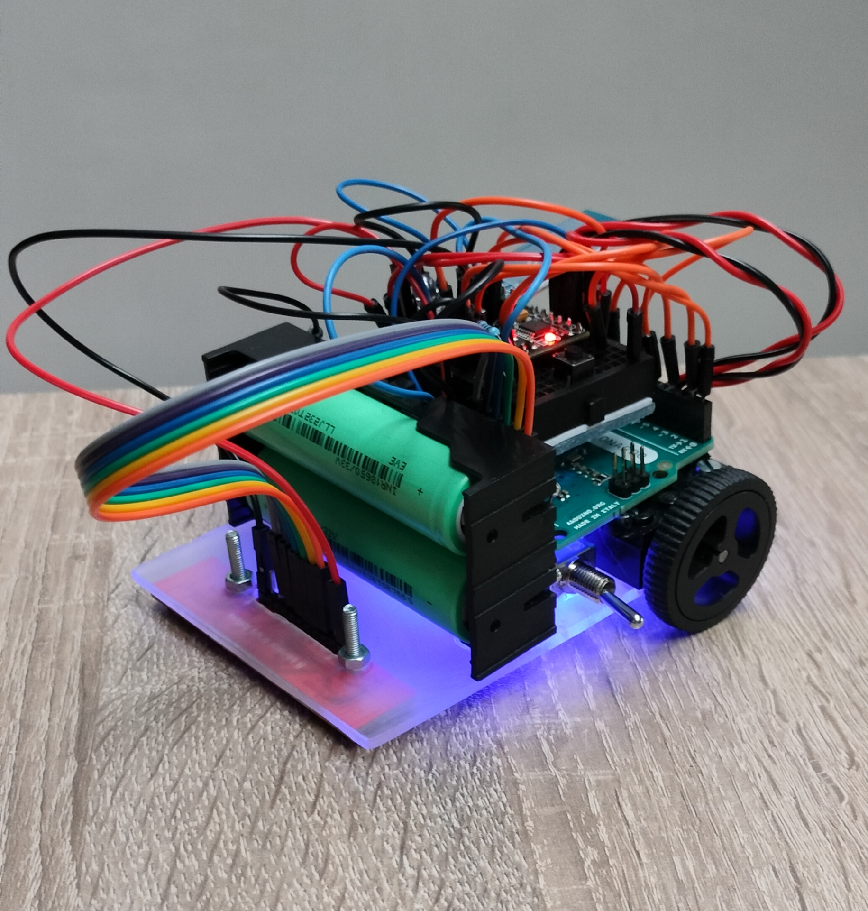

# LineFollower

lege repository die je als template kan gebruiken om een eigen repository te starten voor uw linefollower project

  
## specifications

microcontroller: Arduino Leonardo ATMega32u4

motors: 600 RPM 6V

h-bridge: DRV8833

sensors: QTR-8A IR Line Following sensor

batteries: 18650 Li-ion 3100 mAh

wireless communication: HC-05 Bluetooth

distance sensor - motors: 80mm

weight:280g

speed: 0,325 m/s

